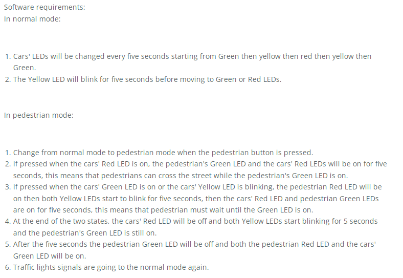
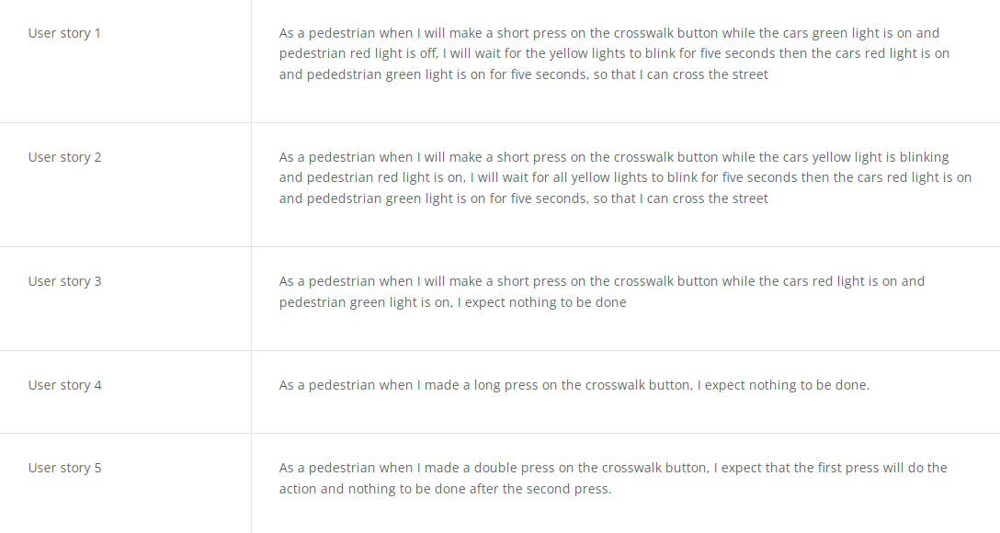

# OnDemandTrafficLightControl
A Graduation Project For Embedded Systems Professional Nanodegree Program Presented By Udacity And EgFWD

# About
A Simple Traffic light that operates in two modes: Normal mode and Pedestrian mode with proteus for simulation.

# Tech. used:

AVR Atmega32 MCU, 2x 3LEDs(Red, Yellow, Green), Push Button, Proteus Software for simulation

# Project Requirements

 

# User Stories

 

# Demo

 

